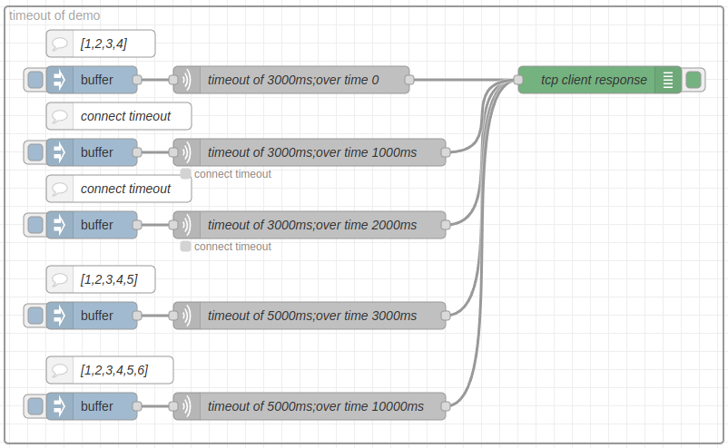
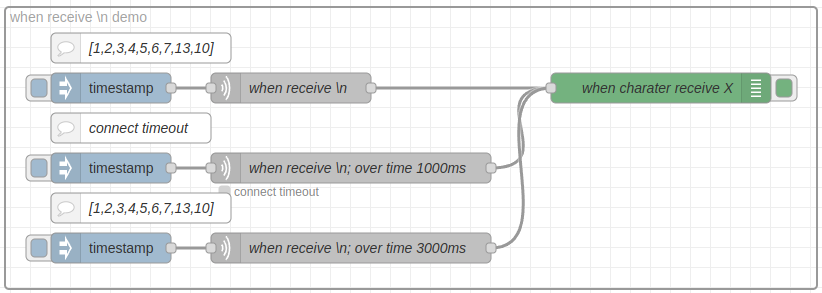
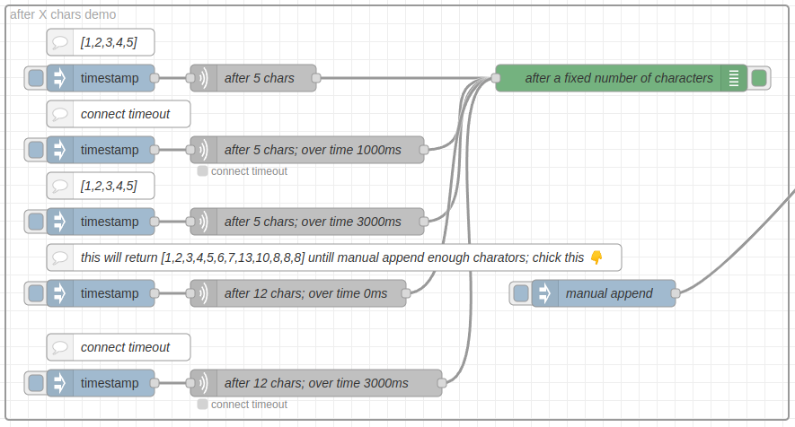

# node-red-contrib-tcp-request2

The official tcp request node of Node-RED has some problems:

If a fixed timeout is set, it will always wait for the same time (although the impact is not great); if a fixed data length is set, if the other party does not return the content, the connection will hang there.

Therefore, a maximum waiting length of x is needed. Within y seconds, if there is no return, a timeout will be reported. However, if x length is returned within y seconds, the waiting will end immediately and the content will be returned.

In addition, the splitc variable has two different meanings in the time and count modes respectively. I think they should be separated.

Different from the official tcp request node, tcp request2 has the following modifications:

1. Retain the original logic based on time, characters, and length.
2. socketTimeout can be set through the overtime parameter in the settings interface.
3. server and port can be set through msg, global, flow, and env.
4. The buffer length can be set manually under non-length-based TCP request methods.

## Demo

* Run `npm start` to start a demo flow with a tcp request node and a tcp in node. The tcp request node sends a request to the tcp in node, which returns a response.
* The example is under `examples/tcp_request2_demo.json`. You can import it into your Node-RED instance.

## Main differences to the official tcp request node

### 1. Settings

### 2. Logical

With test tpc server like this:

## Development

* Install dependencies using `npm install`
* To run tests, execute `npm test`. To add tests, create a files `<description>.spec.js` with a mocha test specification.
* Using [changesets](https://github.com/atlassian/changesets): Before committing a change that should be visible on the changelog run `npx changeset` and input the corresponding information into the wizard. Then add the created file in the `.changeset` folder to the commit.
* Publishing: If not done yet, login to npm using `npm login`. Then run `npx changeset version` to create a new version number, update package.json and the CHANGELOG.md files. Commit these changes with message `Release VX.Y.Z`. Then run ~~`npx changeset publish`~~ `npm publish --access public` to publish to npm. Now run `git push --follow-tags` to push the version tag created by changeset.
